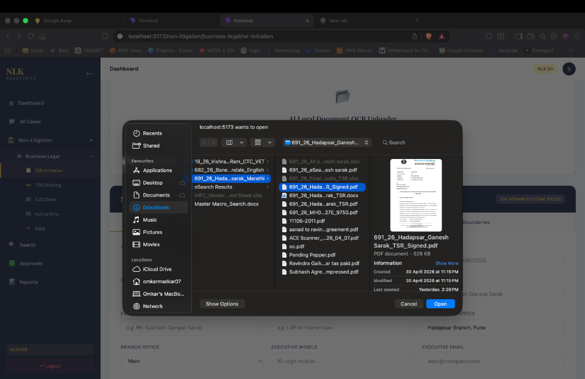
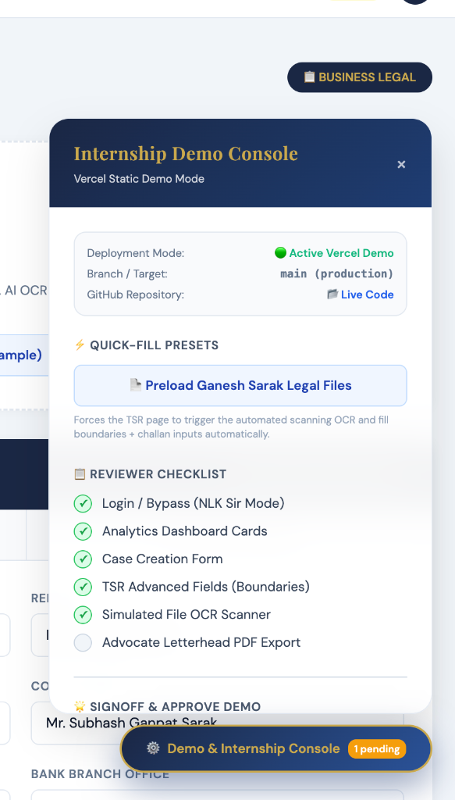
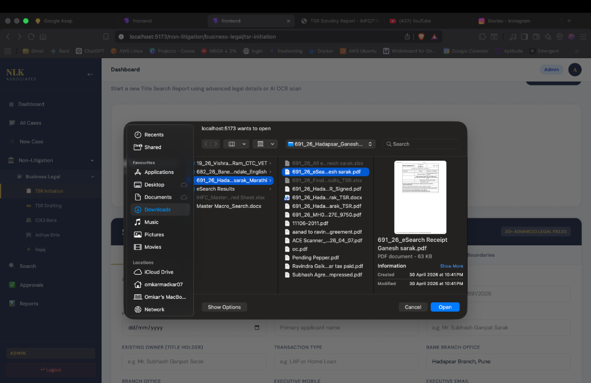
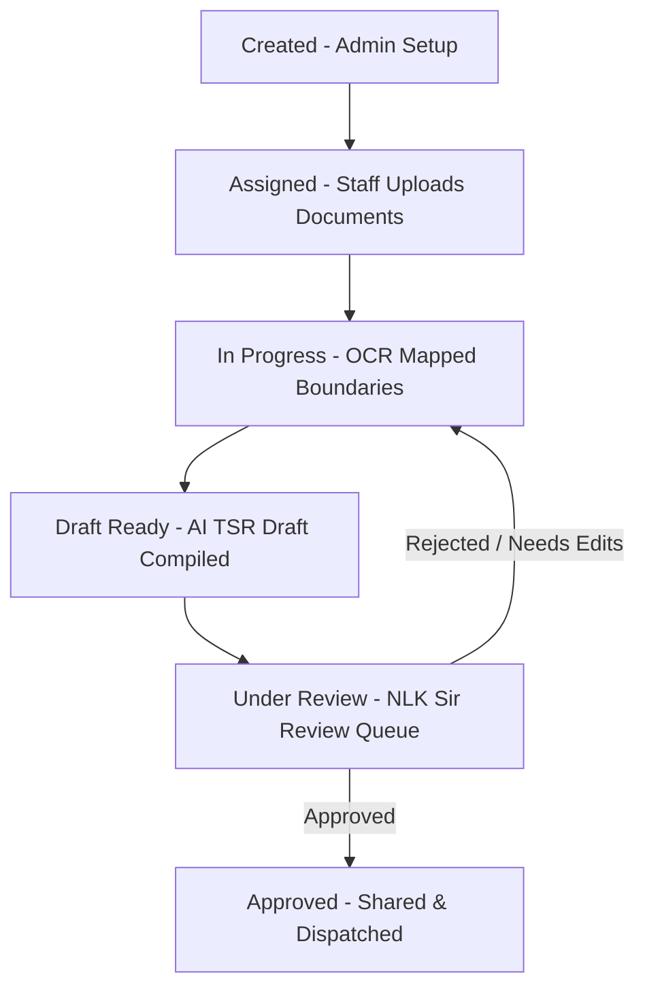

# 🏛️ NLK LAW ASSOCIATES — EXECUTIVE AI DASHBOARD & SCRUTINY ENGINE

> **A premium, high-fidelity Legal Case Management & Title Search Report (TSR) Generation Scrutiny Dashboard custom-built for NLK Law Associates (Indian Law Firm).**
>
> This workspace covers **Phase 1: Core Non-Litigation Operations**, automating administrative case setup, property document uploads, simulated OCR extraction, advanced AI-driven legal opinion drafting, multi-stage approval pipelines, and digital bank report dispatch.

---

## 📸 High-Fidelity UI/UX Page Gallery

The user interface uses a premium **Navy Blue & Regal Gold** aesthetic. Below is a visual walkthrough of all pages in the dashboard:

### 1. Dual-Role Secure Authentication
Features a beautifully styled role-based authentication portal with input validations, role selection, and sleek, responsive login animations.
* **Default Portal View:**
  
* **Auth Status & Validation Feedback:**
  

---

### 2. Interactive Executive Analytics Dashboard
An executive dashboard utilizing **Recharts** to provide real-time metrics on case statuses, bank distribution (ICICI, Aditya Birla, Bajaj), and recent folder activity.


---

### 3. Case Management Center
The central hub for administrative operations. Admins can view cases, track progress via colored status badges, and initialize fresh folders.


---

### 4. Admin Case Initiation Form
A multi-step setup form enabling admins to input new client details, legal bank assignments, SRO parameters, and detailed property boundaries (East, West, South, North).


---

### 5. Property Scrutiny & TSR Initiation
Staff/Advocates can drop or browse property deeds and certificates. Features an OCR progress bar animation, converting raw files into mapped structured fields.


---

### 6. Senior Advocate (NLK Sir) Approval Panel
A dedicated approval console showing pending drafts, allowing the Senior Advocate to review legal opinions, write review notes, and approve/reject cases.


---

### 7. Advocate Letterhead Draft Room
Staff can refine and generate legally structured drafts using a professional, high-fidelity advocate letterhead styled with classic typography.


---

### 8. Dynamic Title Search Report & PDF Viewer
Generates a multi-section legal Title Search Report (TSR) incorporating official law firm seals and signature blocks.


---

## 📋 Project Summary

The NLK Associates Scrutiny Dashboard digitizes the manual property title search process. The system accepts arbitrary deeds, leases, and land documents, extracts the relevant boundaries, ownership history, and SRO records, and compiles a standard legal opinion draft.

### 🔄 Case Status Workflow


---

## 🛠️ Technology Stack & Architecture

### Frontend
| Package | Version | Purpose / Role |
| :--- | :--- | :--- |
| **React** | `^19.2.6` | Component-driven frontend foundation |
| **Vite** | `^8.0.12` | Ultra-fast local development and bundling |
| **Tailwind CSS** | `^4.3.0` | Modern, responsive layout styling |
| **@tailwindcss/vite**| `^4.3.0` | Official Vite plugin for Tailwind v4 compilation |
| **React Router DOM** | `^7.15.0` | Client-side routing with role protected route guards |
| **Recharts** | `^3.8.1` | Dashboard widgets, charts, and visualizations |
| **Axios** | `^1.16.1` | Secure HTTP client pointing to backend APIs |

### Backend
| Package | Version | Purpose / Role |
| :--- | :--- | :--- |
| **Express** | `^5.2.1` | Asynchronous REST API routing |
| **Mongoose** | `^9.6.2` | MongoDB object modeling and document schema validation |
| **JSON Web Token** | `^9.0.3` | Secure, cookie/header-based role validation |
| **Bcryptjs** | `^3.0.3` | Multi-round hash algorithm for user passwords |
| **Multer** | `^2.1.1` | Handling multipart/form-data for file uploads |
| **pdf-parse** | `^2.4.5` | Raw text extraction from uploaded legal property PDFs |
| **pdfkit** | `^0.18.0` | Multi-page legal PDF generation |
| **OpenAI** | `^6.38.0` | Advanced legal terminology analysis and TSR drafting |
| **Dotenv** | `^17.4.2` | Safe environment variables management |

---

## 🎨 Premium Visual & Design System

*   **regal Navy Blue (`#1a2744`):** Primary brand identity color, applied on sidebars, headings, and main navigation elements.
*   **warm Gold Gold (`#c9a84c`):** Highlights, active states, buttons, borders, and brand iconography accents.
*   **Clean backgrounds (`#f1f5f9` & `#ffffff`):** Smooth contrasts, reducing eye strain for lawyers analyzing case folders.
*   **Typography Hierarchy:**
    *   **Headers:** `Cinzel` & `Playfair Display` for a classic, authoritative feel.
    *   **Body & Forms:** `DM Sans` & `Montserrat` for readability.
*   **Layout Structure:** Standard 2-column sidebar design with collapsible menus, action bars, and subtle scale/hover micro-animations.

---

## ✅ Project Progress Tracker

### Completed Milestones (Phase 1 & Phase 2)
*   [x] **Authentication Engine:** Secure JWT login containing role badges (`Admin`, `Staff`, `Senior`).
*   [x] **Responsive Layout Grid:** main wrapper sidebar rendering navigation depending on user role permissions.
*   [x] **Case Database Engine:** Schema modeling for `Case`, `Client`, `Property`, `Document`, `TSRReport`, `ApprovalLog`, and `BankShare`.
*   [x] **Universal PDF Document Scrutiny:** Drag-and-drop file upload with a sleek AI OCR parsing animation.
*   [x] **Backend PDF Parser:** Integrates `pdf-parse` in `Backend/utils/pdfExtractor.js` to extract text from uploads and auto-fill properties using regex field mapping.
*   [x] **National Banks View Filter:** Dynamic routes (`/non-litigation/:bank`) displaying cases for ICICI, Aditya Birla, and Bajaj.
*   [x] **Advocate Draft Room:** Cinzel-typography styled advocate letterhead featuring edit areas for draft summaries, client names, and property description tabs.
*   [x] **Senior Approval Queue:** Review screen displaying client details, parsed property boundaries, draft summaries, and approval/rejection triggers.
*   [x] **Integrated Search & Reports Panel:** Global filters checking cases by bank status and dispatch logs.

### Remaining Tasks (Phase 3 Production Readiness)
*   [ ] **Full PDFKit Compilation:** Fully hook up `pdfkit` in the backend to compile final approved HTML/Markdown TSR drafts into printable PDFs.
*   [ ] **Cloud Storage Integration:** Move local `/uploads` directory to an AWS S3 Bucket or Google Cloud Storage container.
*   [ ] **NodeMailer Dispatch:** Hook up SMTP credentials on the Reports page to email approved legal opinions to bank managers.
*   [ ] **Phase 4 Litigation Module:** Build standard court forms, active hearing trackers, and legal notification widgets.

---

## 🤖 Prompts Repository

Below are the master prompts used to construct this platform, along with recommended prompts to guide future development.

### 💡 Prompts Used to Build This Project

#### 1. System Architecture & Base Layout Scaffolding
```text
Build a premium React 19 + Vite + Tailwind CSS v4 dashboard layout for a Law Firm named "NLK Law Associates". Use a professional, clean Navy Blue (#1a2744) and warm Gold (#c9a84c) palette. The typography should feature Playfair Display for legal titles and DM Sans for data inputs. Set up a collapsible main sidebar, a top breadcrumbs bar with a role selector (Admin, Staff, Senior Advocate), and a clean main content area. Make sure all elements feature sleek hover transitions and appear premium out of the box.
```

#### 2. Drag-and-Drop Scrutiny Page with OCR Animation
```text
Create a 'TSRInitiation.jsx' React component for legal document uploads. Design a modern drag-and-drop region styled in glassmorphism. When the user drops a PDF deed or title report, display a sleek progressive progressive extraction progress bar with custom micro-animations mimicking an OCR scans. Once completed, automatically populate the tabbed form fields with parsed boundaries (East, West, South, North) and applicant information using simulated JSON extractions. Ensure there are no hardcoded presets.
```

#### 3. Advocate Letterhead Drafting Studio
```text
Build a 'TSRDrafting.jsx' rich document editor matching a high-fidelity Advocate Letterhead. In the header, display a gold-crested Advocate stamp with professional typography styled in 'Cinzel' font. Structure the document body into clean legal sections (Part I: Description of Property, Part II: Deeds Evaluated, Part III: SRO Verification, Part IV: Flow of Title, Part V: Boundaries, Part VI: Final Opinion). Make the sections editable with collapsible editors, and render a final signature block complete with lawyer stamps.
```

#### 4. Backend PDF Scrutiny & Field Mapping
```text
Write a Node.js utility using 'pdf-parse' that takes an uploaded legal document, extracts all raw text, and uses robust regular expressions to parse out typical Indian land search variables such as Survey Number, Village, Taluka, District, boundaries (East, West, South, North), and the owner's legal name. Map these extracted parameters directly onto a Mongoose 'Property' model, and return a clean JSON response to the React frontend to pre-fill the case form fields.
```

---

### 🚀 Must-Use Prompts for Future Development

When continuing the project's next phases, supply the following prompts to your AI builder:

#### 1. PDFKit Compiler Route Setup
```text
Create a backend controller in 'Backend/controllers/tsrController.js' that uses 'pdfkit'. Fetch the approved 'TSRReport' draft content from the MongoDB collections. Initialize a custom PDFKit document featuring our corporate styles: set custom page borders, write an elegant headers on each page featuring 'NLK Law Associates' in Navy Blue, draw a regal gold line separator, add page numbers in the footer, import a custom Signature Stamp image on the final page, and send the final PDF buffer back to the user as an attachment download stream.
```

#### 2. AWS S3 Multer Storage Integration
```text
Modify the file upload middleware in 'Backend/middleware/upload.js' to substitute the local storage engine with an Amazon S3 storage engine using 'multer-s3' and '@aws-sdk/client-s3'. Provide support for typical MIME types (PDF, PNG, JPG, DOCX). Organize the uploaded documents in folders structured by Case IDs (e.g., 'NLK-2026-00001/'). Ensure there are no local file traces left in '/uploads'.
```

#### 3. Reports Page & NodeMailer Bank Dispatch
```text
Develop a dispatch route in 'Backend/routes/tsrRoutes.js' utilizing 'nodemailer'. Accept a JSON payload containing Case ID, destination Bank Representative Email, Subject, and custom dispatch body. Pull the generated TSR PDF from AWS S3, attach it to the email, and send it through a secure transport (SSL/TLS) via a corporate SMTP server. Log this transaction in the 'BankShare' and 'ApprovalLog' schemas.
```

---

## ⚙️ Local Installation & Setup

### 📦 Prerequisites
*   **Node.js:** v18.0.0 or higher
*   **MongoDB:** Community Edition running locally (`mongodb://localhost:27017`)
*   **OpenAI Key:** Optional (needed only for real-time OpenAI TSR compilation)

### 📂 Repository Initial Setup
```bash
# Clone the repository
git clone https://github.com/omkarMadkar/NLKAssociates__Dashboard-.git
cd NLKAssociatesDashboard-main
```

### 🎛️ Backend Installation
1.  Navigate into the `Backend` directory:
    ```bash
    cd Backend
    ```
2.  Install dependencies:
    ```bash
    npm install
    ```
3.  Configure environment variables by creating a `.env` file:
    ```env
    PORT=5000
    MONGO_URI=mongodb://localhost:27017/NLKAssociates
    JWT_SECRET=NLK_SUPER_SECRET_TOKEN_2026
    OPENAI_API_KEY=sk-your-openai-api-key-here
    ```
4.  *(Optional)* Populate the database with test administrative users and mock cases:
    ```bash
    node seed.js
    ```
5.  Start the development server:
    ```bash
    npm run dev
    ```

### 💻 Frontend Installation
1.  Open a new terminal window and navigate into the `Frontend` directory:
    ```bash
    cd Frontend
    ```
2.  Install dependencies:
    ```bash
    npm install
    ```
3.  Launch the Vite development environment:
    ```bash
    npm run dev
    ```
4.  Open your browser and navigate to **`http://localhost:5173`** to access the dashboard portal.

---

*Custom-built for NLK Law Associates. All rights reserved © 2026.*
